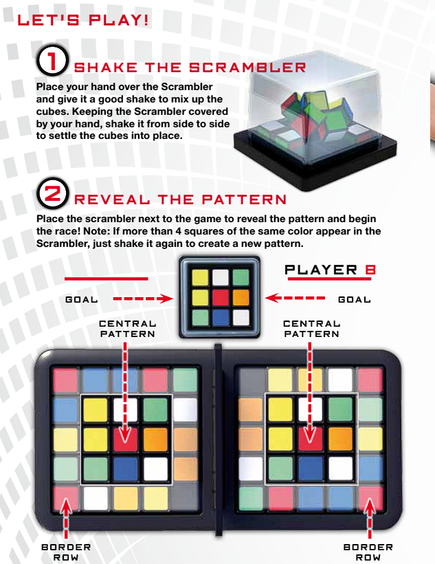
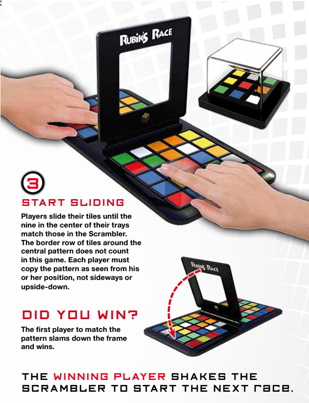

# Mechatronics_Project
Rubiks Race solving by 3 DOF Arm

https://www.hasbro.com/common/documents/dad2884a1c4311ddbd0b0800200c9a66/D597E72E5056900B10F8D850BDEA6516.pdf

# Tasks:
1. Build and 3D print a servo-controlled robotic arm, and design an embedded system for its control.
2. Design and construct a color sensor using electronic components.
3. Create an algorithm to solve the puzzle and determine the necessary movements for the robotic arm.

## What is Rubiks Race Puzzle and How to play? (Actual Puzzle)

  
  

