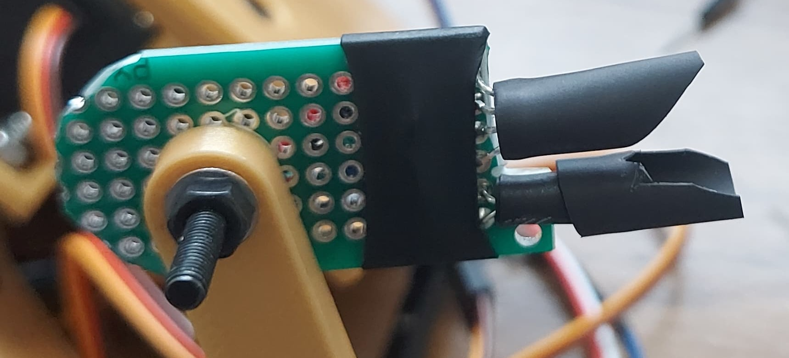

# Mechatronics_Project
Rubiks Race solving by 3 DOF Arm

https://www.hasbro.com/common/documents/dad2884a1c4311ddbd0b0800200c9a66/D597E72E5056900B10F8D850BDEA6516.pdf

&nbsp;
___
# Tasks:
1. Build and 3D print a servo-controlled robotic arm, and design an embedded system for its control.
2. Design and construct a color sensor using electronic components.
3. Create an algorithm to solve the puzzle and determine the necessary movements for the robotic arm.

&nbsp;
 

## What is Rubiks Race Puzzle and How to play? (Actual Puzzle)

  

 
 

<!-- ====================================================================================================== -->

## 1. Build and 3D print a servo-controlled robotic arm, and design an embedded system for its control.
Components: 
  1. Servo MG-996R  * 1
  2. Servo SG90 9G Micro Servo  * 2
  3. Arduino Uno * 1
  4. Arduino Proto Shield * 1
  5. Robotic Arm : [download the model here](https://a360.co/3R4SsM0)
  6. M4 Screws and nuts * 4
  7. M3 screws and nuts * 6

     

  
  

Assembly Instructions: 
* Attach Servo MG-996R with M4 screws
* fix the base with servo assembly on top of it using 4 M3 screws and bolts.
* Assemble an Arm with servo 1 as shown in picture. Assemble such that each servo can operate in limits shown in image.

  
  

  

<!-- ====================================================================================================== -->

## 2. Design and construct a color sensor using electronic components.

Components: 
  1. RGB Led * 1
  2. [5528 LDR Mini Photoresistor](https://cdn11.bigcommerce.com/s-yo2n39m6g3/images/stencil/1280x1280/products/704/6303/d9c8d789-7c9b-42a2-af7b-5ad5c29b4def__71085.1632206657.JPG?c=2?imbypass=on) * 1
  3. Resistor 10 kOhm * 1
  4. Resistor 220 Ohm * 3
  5. [prototype board](https://protosupplies.com/wp-content/uploads/2019/02/PCB-2x8-cm-Universal-PCB-Board.jpg)
  6. [Rubber Finger](https://m.media-amazon.com/images/W/MEDIAX_792452-T1/images/I/71JWB0M2+lL._AC_SX679_.jpg)

Assembly instructions:
* Solder RGB LED and LDR on proto board as shown in fig.
* Extend wires towards Arduino proto shield
* Solder 10k resitor and 220 Ohm resistors on Arduino proto shield as shown in schematic
* 
  

    
    
  

  
 

&nbsp;
 
___
## Circuit Diagram:

    
  

## 3.Create an algorithm to solve the puzzle and determine the necessary movements for the robotic arm.

* [Download the code in src folder of this repo.](src/main.cpp)
* Paste it in your project fodlder as main.cpp
* upload it on arduino Uno.

 
 
 
 
 
 
 
 
 

---
---
---
# Section 1

This is the content of section 1.

<!-- Add a horizontal rule for visual separation -->
---
<!-- Or, add an empty line for additional space -->
&nbsp;
<!-- Or, use HTML   for line break -->
 

# Section 2

This is the content of section 2.

This is a line without indentation.

    This is indented using spaces.

&emsp;This is indented using an em space in HTML.

