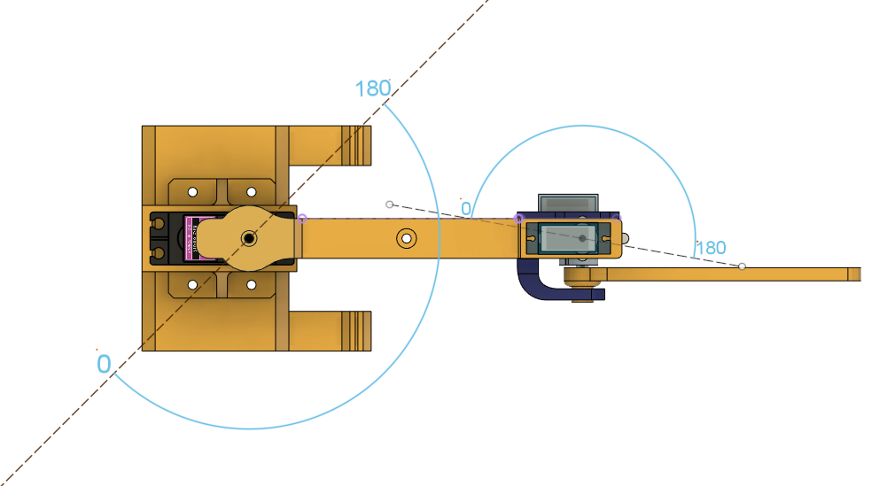

# Rubik's Race puzzle solving by 3 DOF Arm 

  

## What is Rubiks Race Puzzle and How to play? (Actual Puzzle)

click [here](https://www.hasbro.com/common/documents/dad2884a1c4311ddbd0b0800200c9a66/D597E72E5056900B10F8D850BDEA6516.pdf) for details

  

___
# Tasks:
1. Build and 3D print a servo-controlled robotic arm, and design an embedded system for its control.
2. Design and construct a color sensor using electronic components.
3. Create an algorithm to solve the puzzle and determine the necessary movements for the robotic arm.
---
 

<!-- ====================================================================================================== -->

## 1. Build and 3D print a servo-controlled robotic arm, and design an embedded system for its control.

### Components:
  1. Servo MG-996R  * 1
  2. Servo SG90 9G Micro Servo  * 2
  3. Arduino Uno * 1
  4. Arduino Proto Shield * 1
  5. Robotic Arm : [download the model here](https://a360.co/3R4SsM0)
  6. M4 Screws and nuts * 4
  7. M3 screws and nuts * 6
  8. 5v Power Supply

     

  
  

### Assembly Instructions:
* Attach Servo MG-996R with M4 screws
* fix the base with servo assembly on top of it using 4 M3 screws and bolts.
* Assemble an Arm with servo 1 as shown in picture. Assemble such that each servo can operate in limits shown in image.

  
  
  

---

<!-- ====================================================================================================== -->

## 2. Design and construct a color sensor using electronic components.

### Components:

  1. RGB Led * 1
  2. [5528 LDR Mini Photoresistor](https://cdn11.bigcommerce.com/s-yo2n39m6g3/images/stencil/1280x1280/products/704/6303/d9c8d789-7c9b-42a2-af7b-5ad5c29b4def__71085.1632206657.JPG?c=2?imbypass=on) * 1
  3. Resistor 10 kOhm * 1
  4. Resistor 220 Ohm * 3
  5. [prototype board](https://protosupplies.com/wp-content/uploads/2019/02/PCB-2x8-cm-Universal-PCB-Board.jpg) * 1
  6. [Rubber Finger](https://m.media-amazon.com/images/W/MEDIAX_792452-T1/images/I/71JWB0M2+lL._AC_SX679_.jpg) * 1

### Assembly instructions:
* [Solder RGB LED and LDR on proto board as shown in fig.](images/17021272272572036238491611179348.jpg)
* [Extend wires towards Arduino proto shield and solder female connector at end](images/20231209_082113.jpg)
* Solder 10k resitor and 220 Ohm resistors on Arduino proto shield as shown in schematic
* connections :
  + servo -> Arm 1 -> Arduino D9
  + servo -> Arm 2 -> Arduino D10
  + servo -> Arm 2 -> Arduino D11
  + [connect Sensor connector on proto shield as shown in picture](images/20231209_083949.jpg)
              
  

    
    
    
    
    
    
    
    
  

 

---

<!-- ------------------------------------------------------------------------------------------------------------------------------------------------------- -->

## _How color detection works:_

* Color starts with light. Light is a form of electromagnetic radiation, and it travels in waves. Different colors correspond to different wavelengths of light. When light interacts with an object, some wavelengths are absorbed by the object, and others are reflected.
  

      
  

  
  * In this project, RGB LED diod is used as a light source [datasheet](https://cdn.sparkfun.com/datasheets/Components/LED/YSL-R596AR3G4B5C-C10.pdf_gl=1*135yzks*_ga*MjA4NTU0MjE3NC4xNjk4MDI2ODM3*_ga_T369JS7J9N*MTcwMjEzMzIzMi41LjAuMTcwMjEzMzIzMi42MC4wLjA.)
 
    

      
      
    

* A photoresistor, composed of semiconductor materials like cadmium sulfide, changes its electrical resistance based on the intensity of incident light. When exposed to light, it generates electron-hole pairs, altering its conductivity. The resistance is inversely proportional to light intensity, decreasing as light increases. Photoresistors are used in circuits, often arranged in voltage dividers, to detect or control light levels. For detail information click [here](https://www.circuitstoday.com/wp-content/uploads/2017/10/Photoresistor.jpg).
  * click [here](https://cdn.sparkfun.com/datasheets/Sensors/LightImaging/SEN-09088.pdf) for datasheet
    

      
      
    

*  RGB LED Flashes Each color for 30ms. At same time Arduino reads Analog voltage on pin A0(where sensor connected)
  

    
    
  

  
  * First Step is Calibration:
    1. It is the process of setting the referece RGB values for reffered color.
    2. RGB LED Flashes Each color for 30ms. At same time Arduino reads Analog voltage on pin A0(where sensor connected)
    3. The voltage reading is saved in arduino and used as a reference template for that color.
    4. Step 2 and 3 repeted for each different color in puzzle.
    
  * Reading color:
    * Next time whenever it scan any random tile, it flashes RGB light and read sensor reading.
    * This readings are gets compared with reference templates and color of closes matching template is get assign to current tile.

&nbsp;
 
___

## 3. Create an algorithm to solve the puzzle and determine the necessary movements for the robotic arm.
### Final Assembly:
* Circuit Diagram

    

* [Download the code in src folder of this repo.](src/main.cpp)
* Paste it in your project folder as main.cpp
* upload it on arduino Uno.

---

### _Working flow of code._
1. **It starts with calibration of sensor.**
   
    * Rotic arm go to home position.
    * It waits for 15 seconds. You need to arrange first two rows of puzzle like shown in below image (sequence of color must be exact)
    * After 15 seconds it start calibration
      

      
Calibration process in details

      
      1.  It is the process of setting the referece RGB values for reffered color.
      2.  RGB LED Flashes Each color for 30ms. At same time Arduino reads Analog voltage on pin A0(where sensor connected)
      3.  The voltage reading is saved in arduino and used as a reference template for that color.
      4.  Step 2 and 3 repeted for each different color in puzzle.
       
      

      

        
      

2. **Reading Target Pattern:**
   * After calibration Arm goes to home position.
   * It again wait for 15 seconds.
   * You need to shuffle a puzzle randomly. Below image is one example.
     

      
    

    * After 15 seconds color sensor goes to each location at center and Read the color of each pallet and save it as a target pattern.
    * After Reading target pattern it again goes to home position.

  3. **Raading Puzzle pattern.**
     * It agian wait for 15 seconds and give time to user to shuffle pattern as much as possible. (Below is the image example)
     

        
      

  4. After Gathering all needed information it start solving the puzzle. It uses A* algorithm to find the shortest path.
  5. As soon as it finds best path it start moving the tiles.
  6. After solving the puzzle it agian go to home position.
